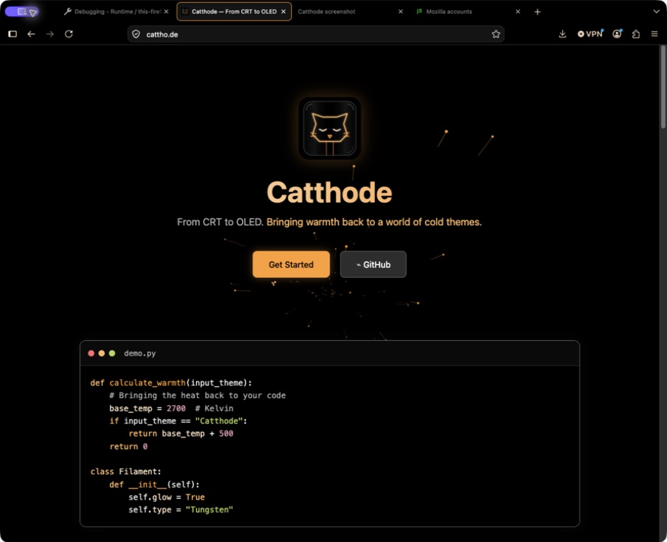

# Catthode for Firefox

> **From CRT to OLED.** Bringing warmth back to a world of cold themes. [cattho.de](https://cattho.de/)

A signed-ready static WebExtension theme for Firefox, including horizontal and vertical tabs, toolbar fields, popups, sidebars, and the new-tab page.



## Local installation

Firefox requires distributed themes to be signed. For a temporary check without changing your normal profile:

```sh
npx --yes web-ext@latest run --no-reload
```

The command creates a temporary Firefox profile and removes it when Firefox exits. You may also download the release ZIP and load it through `about:debugging` for the current session.

## Add-ons store

The manifest includes the stable ID `catthode@cattho.de` and AMO-ready metadata. Publishing still requires a Mozilla Add-ons account and API credentials; that handoff is tracked separately.

## Validation

CI runs Mozilla's current `web-ext lint --warnings-as-errors` and `web-ext build`. The build excludes listing collateral so the upload ZIP contains only the theme manifest and license. No local Firefox installation is needed to produce the release package.

## License

MIT
